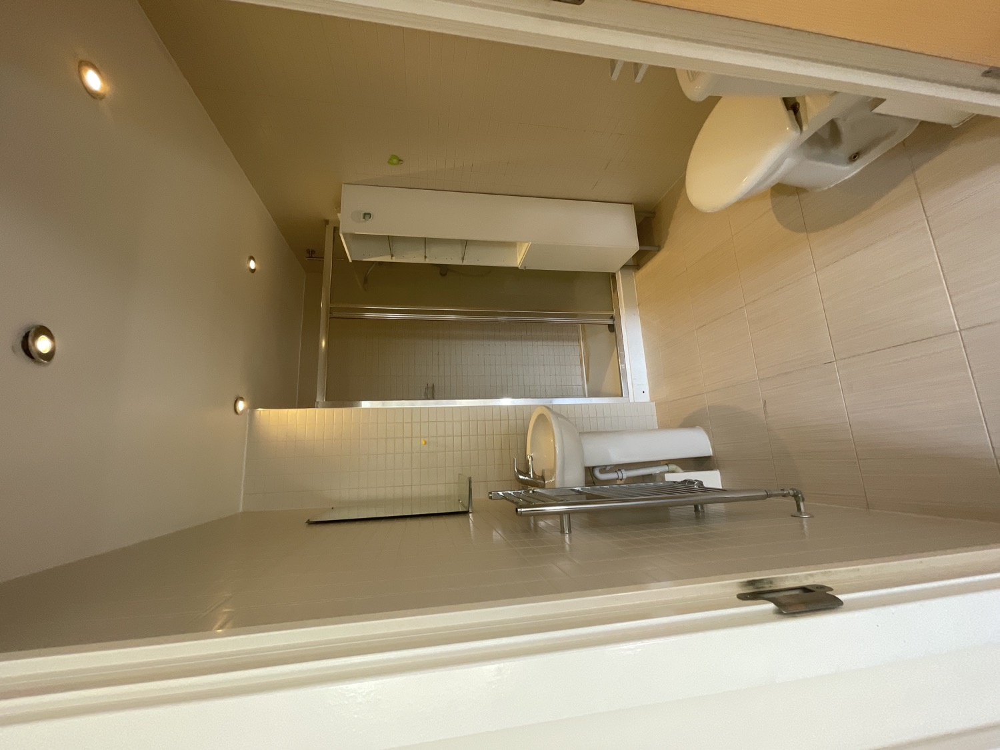
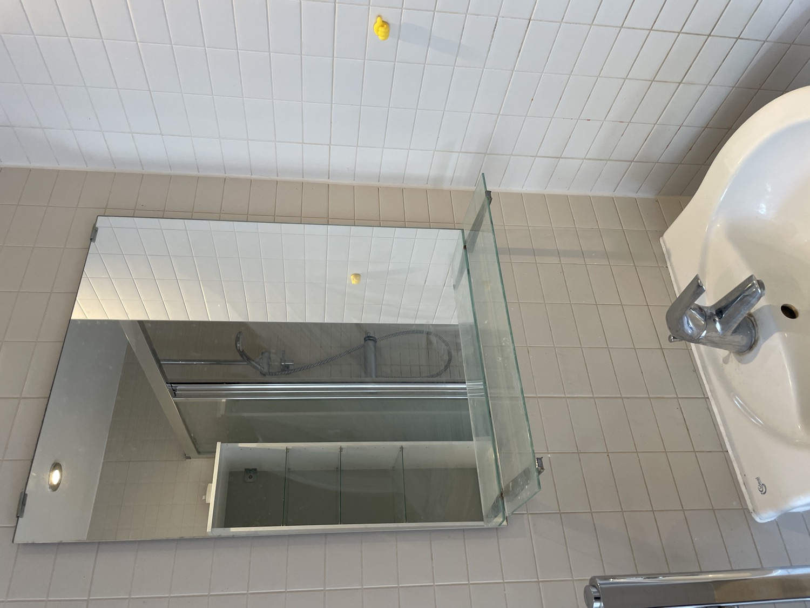
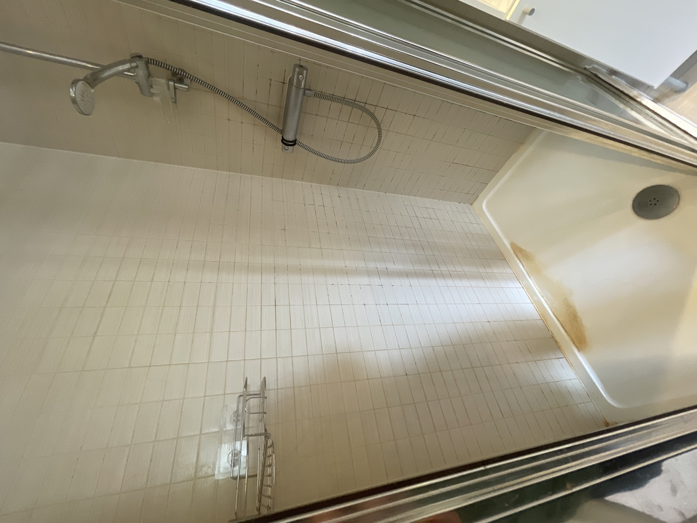

# 1St Floor Ensuite

## Photos (3 images)

*Images downsampled to 1500px for reference. Originals in Apple Notes.*

## Observations & Actions

House walkthrough/1st floor ensuite

En-suite. Light switch is outside behind door - very annoying. Could we move it or switch to a pull system or automatic lights?

Mirror has seen better days

Shower could do with replacing/deep clean

No toilet roll holder 

Make decision on freestanding storage unit. Could look good with a clean.

Need bidet in downstairs toilet. 1st floor en suite probably too tricky (toilet is opposite sink)
