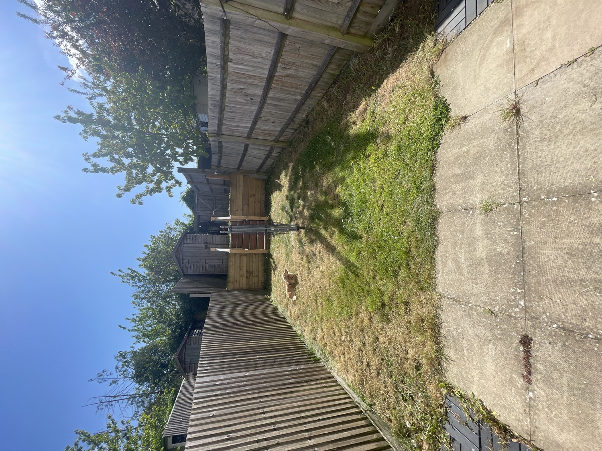
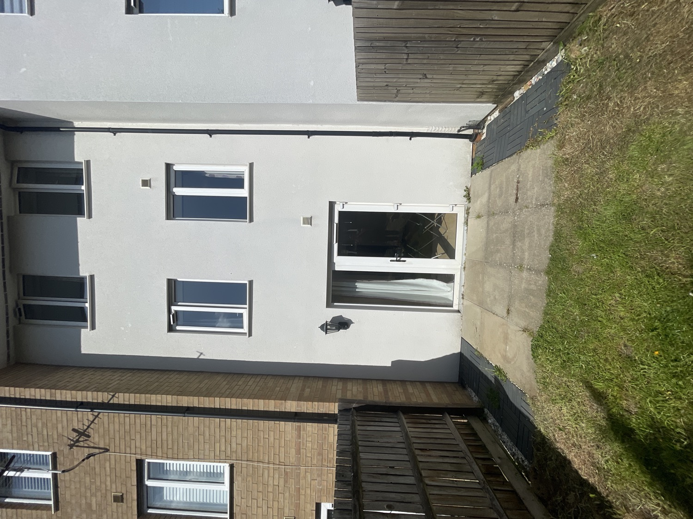
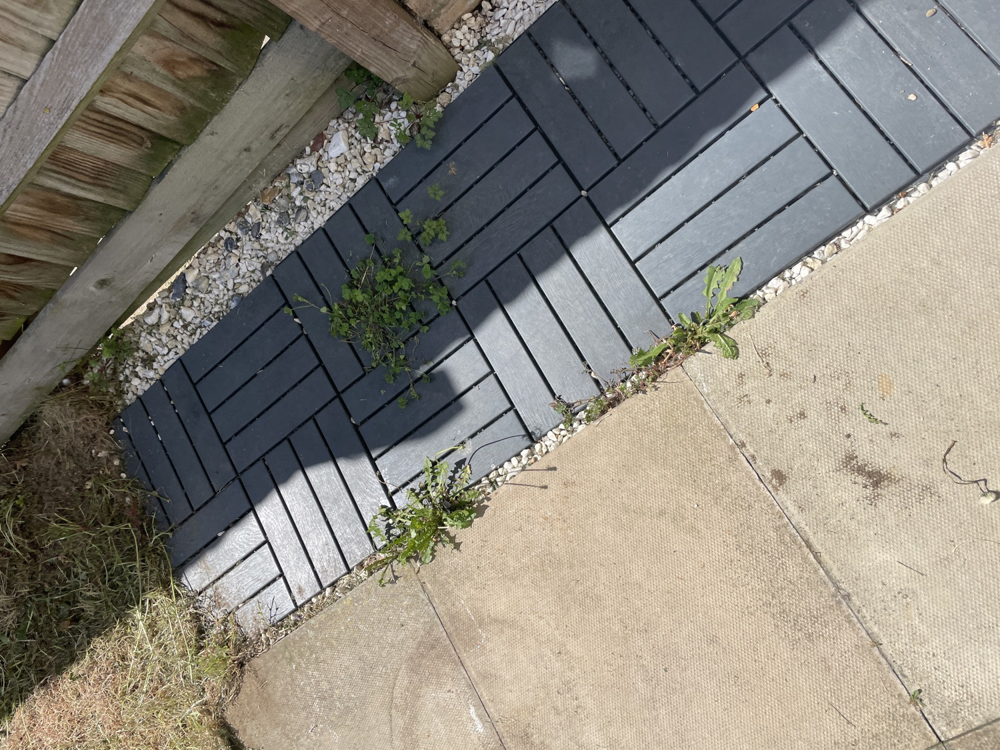
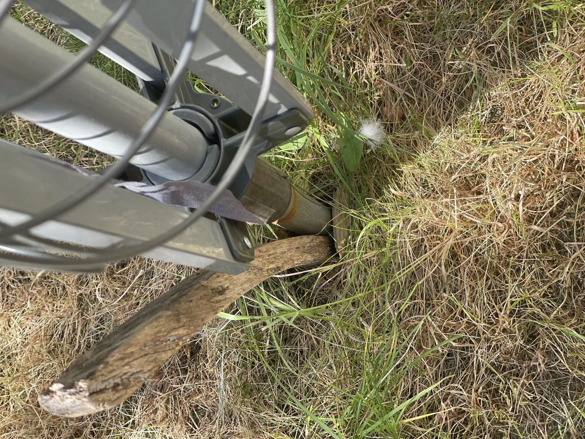
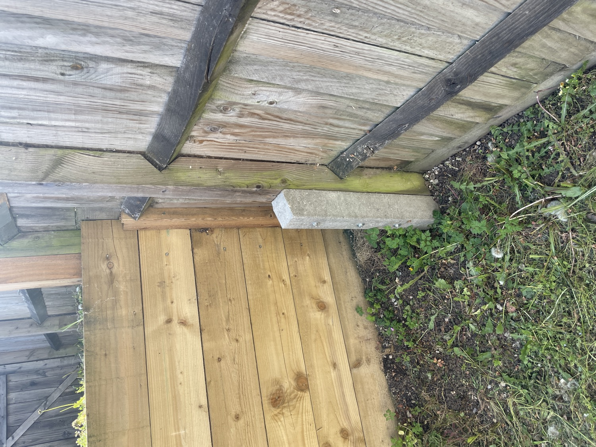
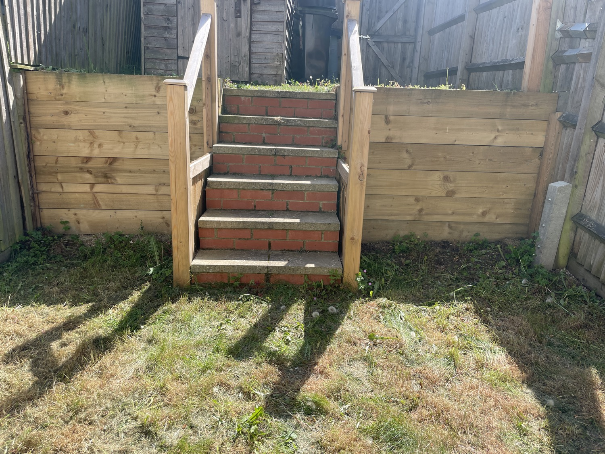
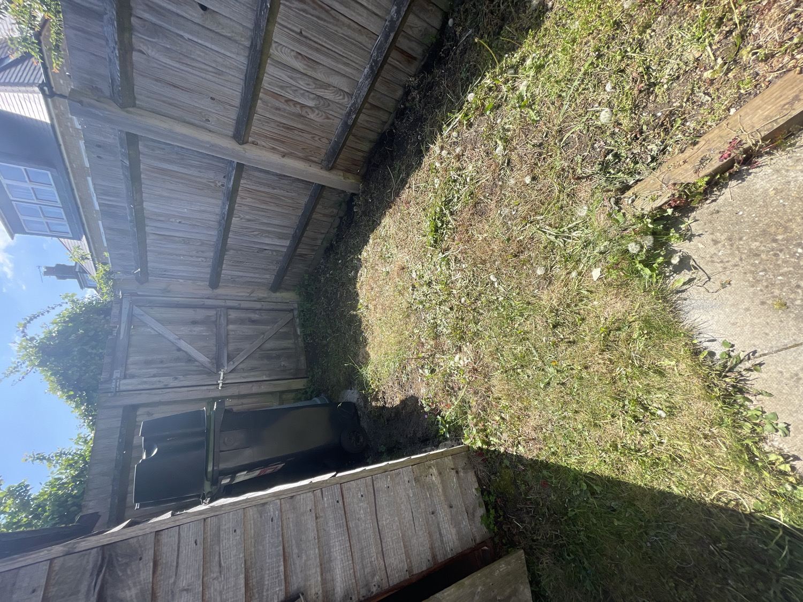
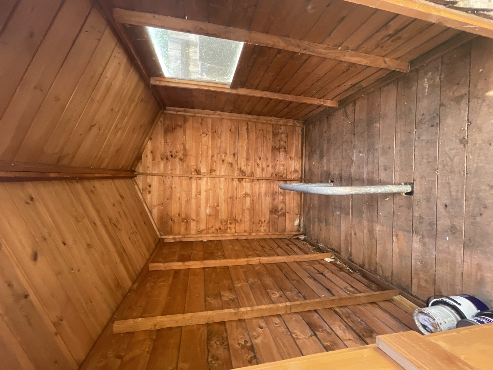
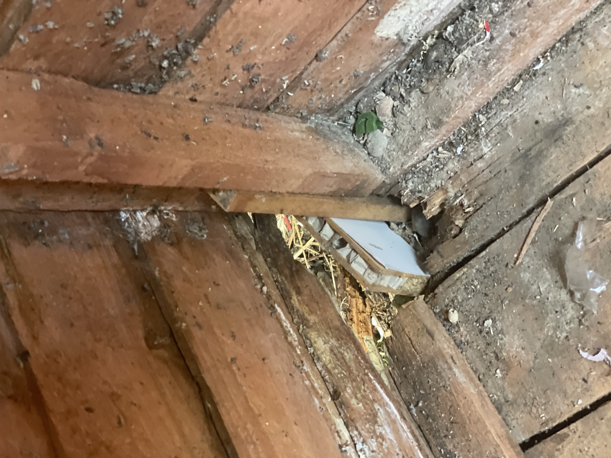
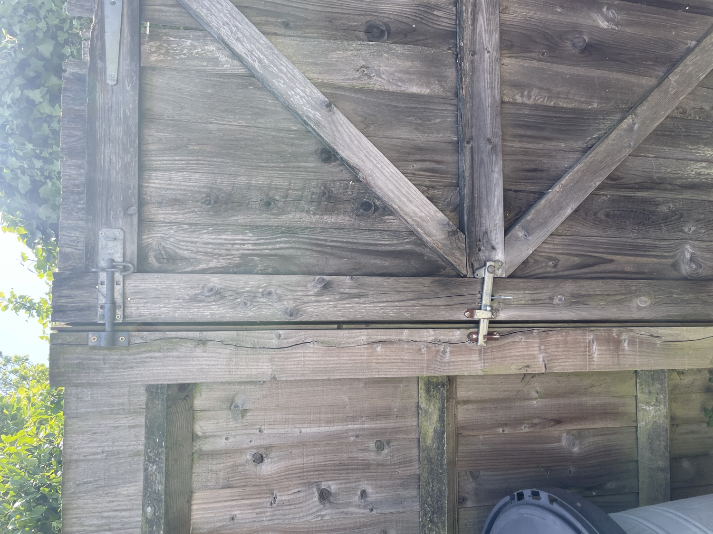

# Garden And Shed

## Photos (10 images)

*Images downsampled to 1500px for reference. Originals in Apple Notes.*

## Observations & Actions

House walkthrough/garden and shed

Garden

Could install security light/camera?

Basic patio weeding. Lawn mowing. Lawn looks in okay shape.

Washing line does not have proper placing.

Fence post has extra concrete post attached.

Space for planters by steps? Not as much sunlight

more patchy ground - could patio/deck?

Shed has metal post inside

Rotted at corner and floorboards on one side

Back gate - bolted but not secure
