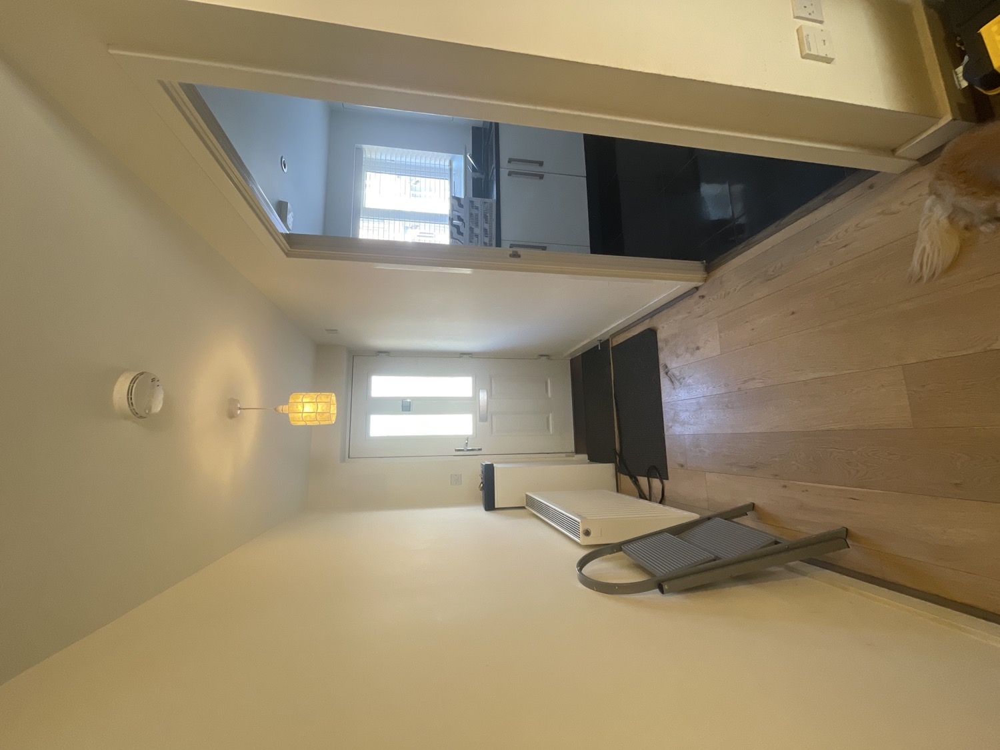
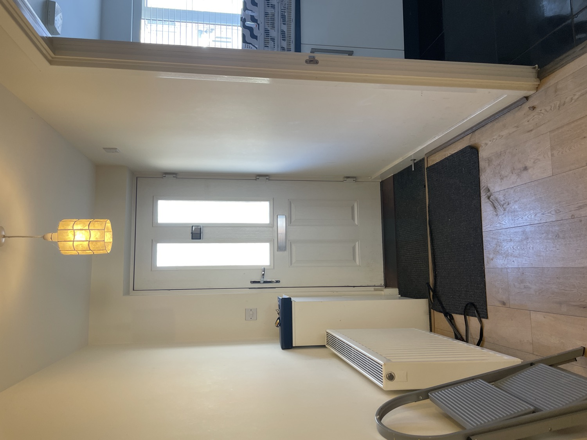
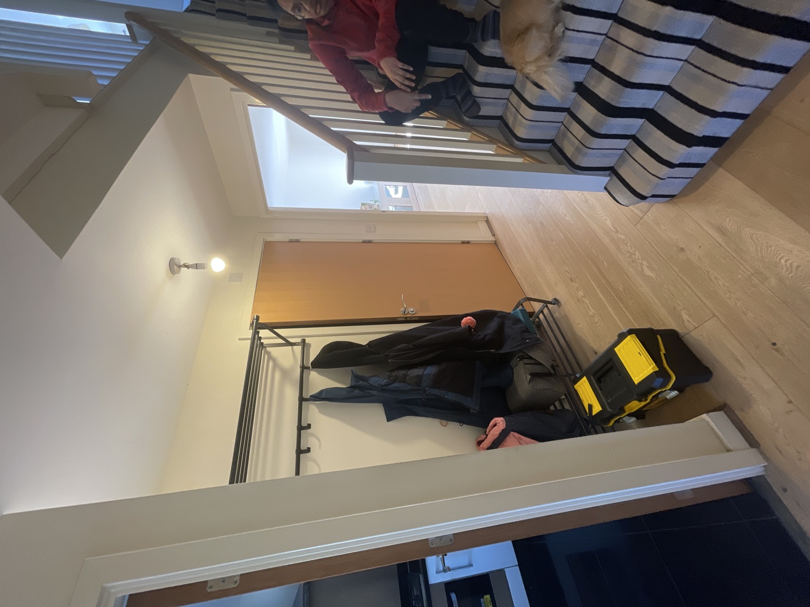
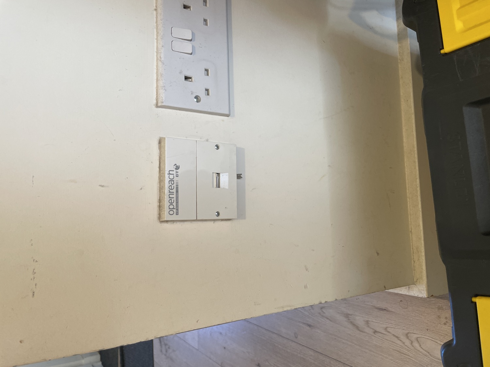
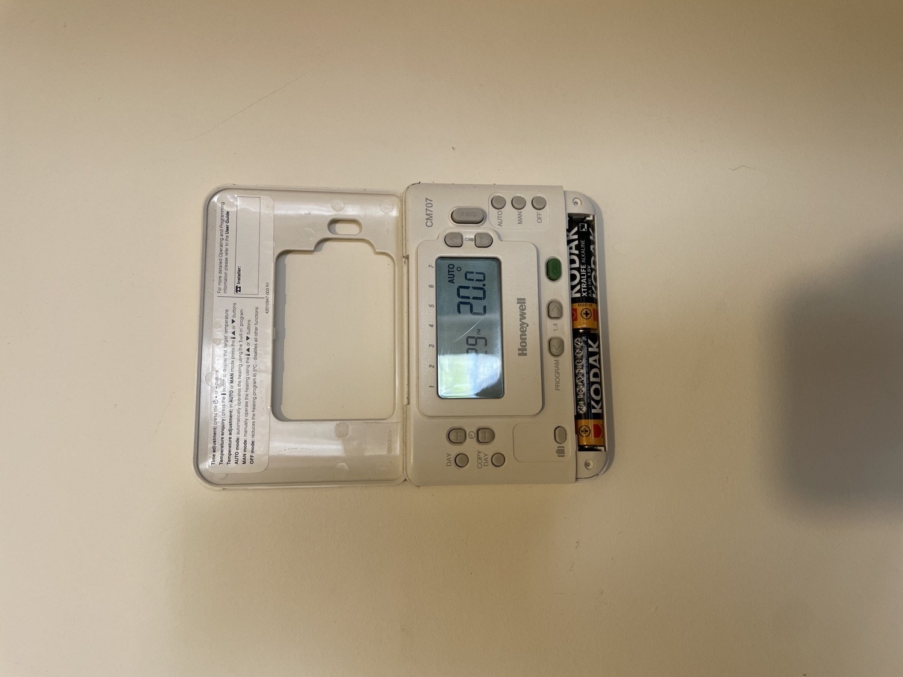
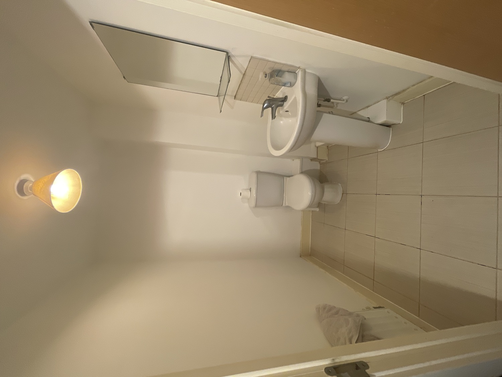
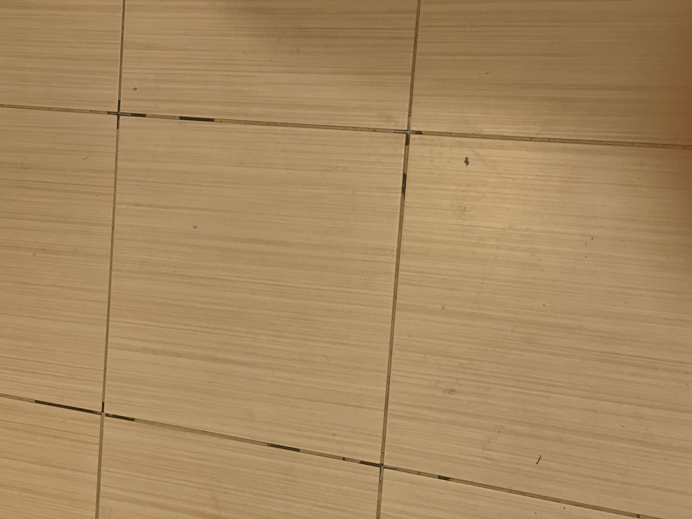
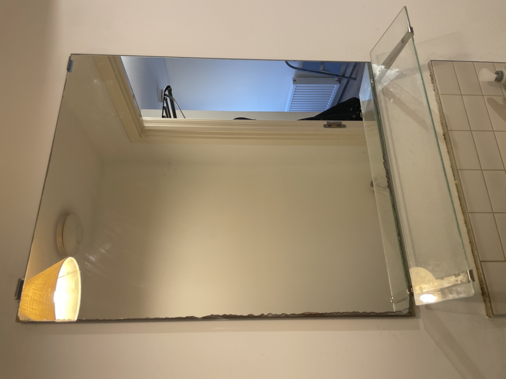
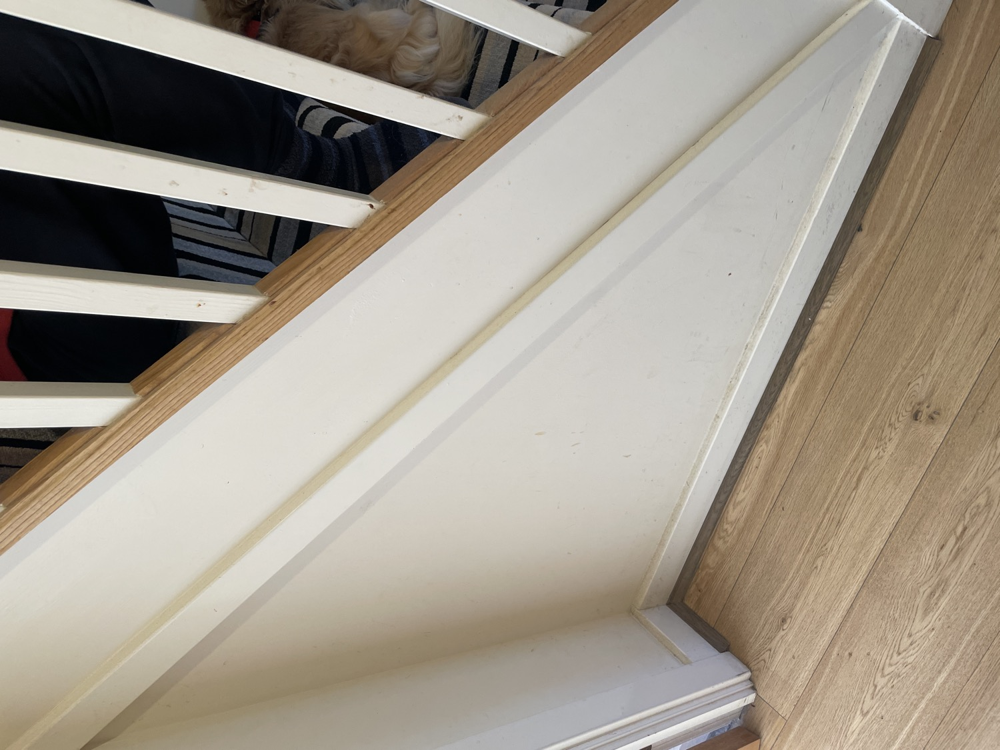
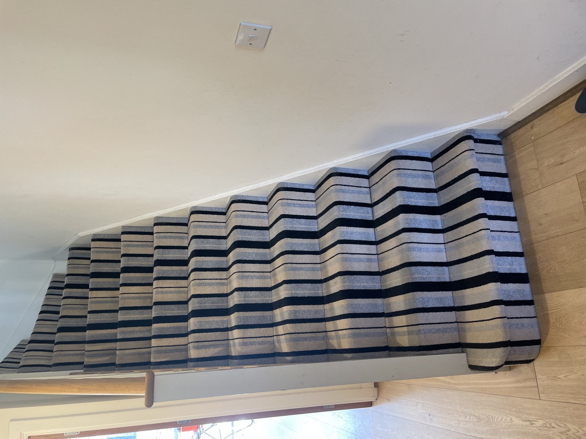

# Ground Floor Hallway

## Photos (10 images)

*Images downsampled to 1500px for reference. Originals in Apple Notes.*

## Observations & Actions

House walkthrough/ground floor hallway
Entrance hall

Doormat is too recessed, wood sticks out. Could do with replacing, trip hazard.

EZVIZ doorbell needs setup but requires WiFi 

Hallway. Wall needs painting. Lampshade needed.

Old DSL socket

Honeywell thermostat in the hallway. Would like to install smart heating system and radiator smart valves.

Downstairs bathroom

Grouting is worn out and missing
No toilet roll holder

Mirror worn round edges, shelf is falling down.

We would like to add storage to this bathroom - cleaning supplies, dog food shelf.

Door handle has a bit of play. Lock is rusty.

Potential under stairs space? Hollow sound when knocking

Carpet - to replace at some point
